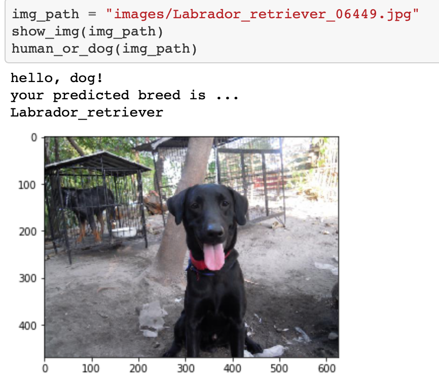
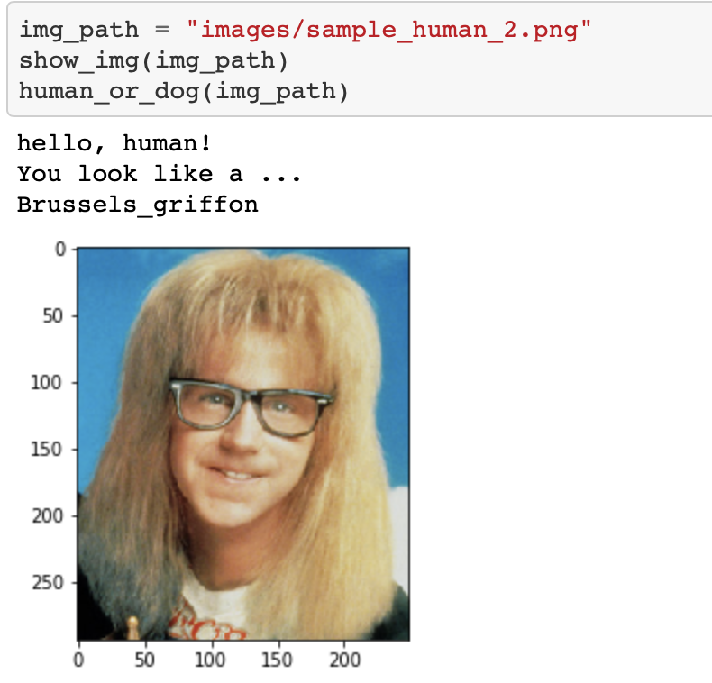

# Data Scientist Nanodegree

# Convolutional Neural Networks

# Project: Write an Algorithm for a Dog Identification App

# Project Overview

If you are looking for a more guided capstone project related to deep learning and convolutional neural networks, this might be just it. The goal is to classify images of dogs according to their breed, developing an algorithm that could be used as part of a mobile or web app. If a dog is detected in the image, it will provide an estimate of the dog's breed. If a human is detected, it will provide an estimate of the dog breed that is most resembling. 

# project motivation

i've completed several guided projects, and now's my chance to show off your skills and creativityIn this capstone project, i will leverage what i’ve learned throughout the program to build a data science project.
 
# The Road Ahead

We break the notebook into separate steps.  Feel free to use the links below to navigate the notebook.

* [Step 0](#step0): Import Datasets
* [Step 1](#step1): Detect Humans
* [Step 2](#step2): Detect Dogs
* [Step 3](#step3): Create a CNN to Classify Dog Breeds (from Scratch)
* [Step 4](#step4): Use a CNN to Classify Dog Breeds (using Transfer Learning)
* [Step 5](#step5): Create a CNN to Classify Dog Breeds (using Transfer Learning)
* [Step 6](#step6): Write your Algorithm
* [Step 7](#step7): Test Your Algorithm

# Instructions

If you want to run this code on your local computer, you'll also need to download the following;

[Dog dataset](https://s3-us-west-1.amazonaws.com/udacity-aind/dog-project/dogImages.zip). Unzip the folder and place it in the repo, at location path/to/dog-project/dogImages.

[Human dataset](https://s3-us-west-1.amazonaws.com/udacity-aind/dog-project/lfw.zip). Unzip the folder and place it in the repo, at location path/to/dog-project/lfw. If you are using a Windows machine, you are encouraged to use 7zip to extract the folder.

[VGG-16 bottleneck](https://s3-us-west-1.amazonaws.com/udacity-aind/dog-project/DogVGG16Data.npz) features for the dog dataset. Place it in the repo, at location path/to/dog-project/bottleneck_features.

[VGG-19 bottleneck features](https://s3-us-west-1.amazonaws.com/udacity-aind/dog-project/DogVGG19Data.npz) for the dog dataset. Place it in the repo, at location path/to/dog-project/bottleneck_features.

[ResNet-50 bottleneck features](https://s3-us-west-1.amazonaws.com/udacity-aind/dog-project/DogResnet50Data.npz) for the dog dataset. Place it in the repo, at location path/to/dog-project/bottleneck_features.

[Inception bottleneck features](https://s3-us-west-1.amazonaws.com/udacity-aind/dog-project/DogInceptionV3Data.npz) for the dog dataset. Place it in the repo, at location path/to/dog-project/bottleneck_features.

[Xception bottleneck](https://s3-us-west-1.amazonaws.com/udacity-aind/dog-project/DogXceptionData.npz) features for the dog dataset. Place it in the repo, at location path/to/dog-project/bottleneck_features

I recommend setting up an environment for this project to ensure you have the proper versions of the required libraries.

# Install

For Mac/OSX:

	conda env create -f requirements/aind-dog-mac.yml
	source activate aind-dog
	KERAS_BACKEND=tensorflow python -c "from keras import backend"
For Linux:

	conda env create -f requirements/aind-dog-linux.yml
	source activate aind-dog
	KERAS_BACKEND=tensorflow python -c "from keras import backend"
For Windows:

	conda env create -f requirements/aind-dog-windows.yml
	activate aind-dog
	set KERAS_BACKEND=tensorflow
	python -c "from keras import backend"
 
This project requires Python 3 and the following Python libraries installed:

NumPy

Pandas

matplotlib

scikit-learn

keras

OpenCV

Matplotlib

Scipy

Tqdm

Pillow

Tensorflow

Skimage

IPython Kernel

You will also need to have software installed to run and execute an iPython Notebook

I recommend you install Anaconda, a pre-packaged Python distribution that contains all of the necessary libraries and software for this project

# file descriptions

there is dog_app.ipynb where the possible solution will found.

there is bottleneck_features when you Pick one of the above architectures, download the corresponding bottleneck features, and store the downloaded file in the bottleneck_features/ folder in the repository.

there is images where you will find the images to test your algorithm . Feel free to use any images you like. Use at least two human and two dog images.

there is saved_models where you will find the models those i worked on

# result section 

I used the 'transfer learning - Resnet50 model' to implement an algorithm for a Dog identification application. The user provides an image, and the algorithm first detects whether the image is human or dog. If it is a dog, it predicts the breed. If it is a human, it returns the resembling dog breed.where the model produced the test accuracy of around 80%. 
Here are examples of the algorithms:

# A blog post

